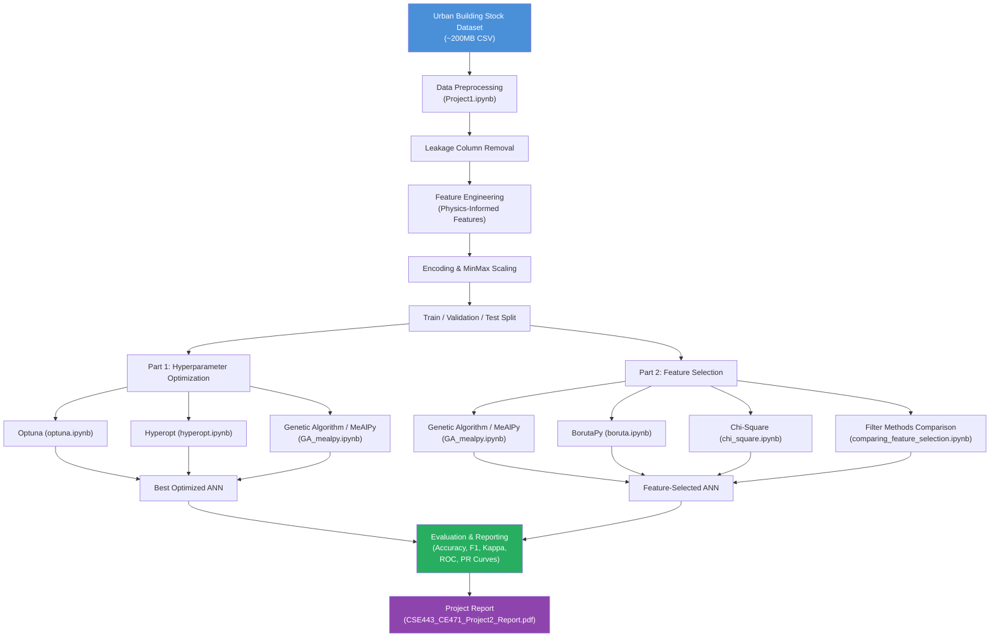

# CSE443 / CE471 — AI for Intelligent Built Environment Systems
## Assignment #2: ANN Hyperparameter Tuning & Feature Selection

<p align="center">
  
  
  
  
  
</p>

---

## 📋 Short Description

This project applies **hyperparameter optimization** and **feature selection** techniques to an Artificial Neural Network (ANN) built for predicting the **Simple Building Energy Rating** of urban buildings. The dataset used is the [Urban Building Energy Stock Dataset](https://data.mendeley.com/datasets/m6vv9k9gcd/5).

---

## 🏗️ Project Overview

Buildings account for a significant portion of global energy consumption. Accurately predicting a building's energy rating enables urban planners and engineers to make data-driven decisions for sustainable design.

This assignment extends a previously built ANN classifier (Assignment #1) in two directions:

1. **Part 1 — Hyperparameter Optimization**: Using meta-heuristic algorithms (Genetic Algorithm via MeAlPy, Optuna, Hyperopt) to find optimal ANN hyperparameters.
2. **Part 2 — Feature Selection**: Identifying the most informative features using meta-heuristic search (GA via MeAlPy), BorutaPy, and filter-based methods (Chi-Square, Information Gain, Gini Index).

---

## 🎯 Objectives

- Apply two different hyperparameter optimization engines (Optuna, Hyperopt) and a meta-heuristic algorithm (Genetic Algorithm via MeAlPy) to an ANN.
- Implement three feature selection techniques (meta-heuristic, BorutaPy, filter-based) and analyze their impact on classification performance.
- Evaluate all models using accuracy, precision, recall, F1-score, Cohen's Kappa, Confusion Matrix, AUC-ROC, and Precision-Recall curves.
- Prepare a professional project report documenting all findings.

---

## ✨ Features

### Part 1 — Hyperparameter Optimization
| Notebook | Method | Description |
|---|---|---|
| `optuna.ipynb` | **Optuna** | Tree-structured Parzen Estimator (TPE) based Bayesian optimization |
| `hyperopt.ipynb` | **Hyperopt** | Sequential model-based optimization (SMBO) |
| `GA_mealpy.ipynb` | **Genetic Algorithm** | Meta-heuristic evolutionary search via MeAlPy library |

**Optimized Hyperparameters:**
- Learning Rate
- Batch Size
- Number of Hidden Layers
- Number of Units per Layer
- Dropout Rate
- Activation Function
- Optimizer (SGD, Adam, RMSProp)

### Part 2 — Feature Selection
| Notebook | Method | Category |
|---|---|---|
| `GA_mealpy.ipynb` | **Genetic Algorithm** | Meta-heuristic |
| `boruta.ipynb` | **BorutaPy** | Wrapper |
| `chi_square.ipynb` | **Chi-Square** | Filter-based |
| `comparing_feature_selection.ipynb` | **Chi-Square vs Info Gain vs Gini Index** | Filter-based Comparison |

### Evaluation Metrics (All Models)
- Per-class Accuracy, Precision, Recall, F1-Score table
- Confusion Matrix
- Training/Validation Loss & Accuracy curves
- Cohen's Kappa Score
- AUC-ROC Curves (per class)
- Precision-Recall Curves (per class)

---

## ⚙️ Requirements

### System Requirements
| Requirement | Specification |
|---|---|
| Operating System | Windows 10/11, Ubuntu 20.04+, macOS 12+ |
| Python Version | 3.10 or higher |
| RAM | 16 GB recommended (dataset is ~200 MB) |
| GPU | Optional but strongly recommended for training (CUDA-compatible) |

### Software Requirements
- Jupyter Notebook or JupyterLab
- See [requirements.txt](requirements.txt) for all Python packages

---

## 🛠️ Technologies

| Technology | Purpose |
|---|---|
| **Python 3.10+** | Core programming language |
| **TensorFlow / Keras** | ANN model definition, training, and evaluation |
| **Keras Tuner** | Supplementary hyperparameter search utilities |
| **Optuna** | Bayesian hyperparameter optimization (TPE sampler) |
| **Hyperopt** | Sequential model-based hyperparameter optimization |
| **MeAlPy 3.0.1** | Meta-heuristic library — Genetic Algorithm for HPO & feature selection |
| **BorutaPy** | Wrapper-based feature selection using Random Forest |
| **scikit-learn** | Preprocessing, metrics, Chi-Square & mutual information feature selection |
| **NumPy 1.26.0** | Numerical computing (pinned for MeAlPy compatibility) |
| **Pandas 2.1.4** | Data loading, preprocessing, and analysis |
| **Matplotlib / Seaborn** | Visualization (loss curves, confusion matrix, ROC curves) |

---

## 🏛️ Project Architecture



---

## 📁 Project Structure

```
221805025_211803011_Project2/
│
├── README.md                              ← This file
├── requirements.txt                       ← Python dependencies
├── .gitignore                             ← Git ignore rules
│
├── notebooks/
│   ├── Project1.ipynb                     ← Base ANN model (from Assignment 1),
│   │                                        data loading, preprocessing, EDA,
│   │                                        training, and full evaluation
│   │
│   ├── optuna.ipynb                       ← Part 1: Hyperparameter tuning with Optuna
│   ├── hyperopt.ipynb                     ← Part 1: Hyperparameter tuning with Hyperopt
│   ├── GA_mealpy.ipynb                    ← Part 1 & 2: Genetic Algorithm via MeAlPy
│   │                                        (both HPO and feature selection)
│   │
│   ├── boruta.ipynb                       ← Part 2: Feature selection with BorutaPy
│   ├── chi_square.ipynb                   ← Part 2: Chi-Square feature selection
│   └── comparing_feature_selection.ipynb  ← Part 2: Comparison of Chi-Square,
│                                             Information Gain, and Gini Index
│
├── models/
│   ├── best_model.keras                   ← Best ANN model (base, from Project1)
│   ├── best_resnet_tuned.keras            ← Tuned ResNet-style model
│   └── final_optimized_model.keras        ← Final optimized model
│
└── CSE443_CE471_Project2_Report.pdf       ← Project report (submitted deliverable)
```

> **Note:** The dataset file `urban_building_stock_datasets_17042024.csv` (~200 MB) is **not included** in this repository due to its size. See [Installation](#-installation) for download instructions.

---

## 🚀 Installation

### 1. Clone the repository

```bash
git clone https://github.com/<YOUR_USERNAME>/221805025_211803011_Project2.git
cd 221805025_211803011_Project2
```

### 2. (Recommended) Create a virtual environment

```bash
# Windows
python -m venv .venv
.venv\Scripts\activate

# Linux / macOS
python3 -m venv .venv
source .venv/bin/activate
```

### 3. Install dependencies

```bash
pip install -r requirements.txt
```

> ⚠️ **Important**: `numpy==1.26.0` and `pandas==2.1.4` are pinned because `mealpy==3.0.1` requires these specific versions for compatibility with TensorFlow.

### 4. Download the dataset

Download the **Urban Building Energy Stock Dataset** from Mendeley Data:

👉 **[https://data.mendeley.com/datasets/m6vv9k9gcd/5](https://data.mendeley.com/datasets/m6vv9k9gcd/5)**

Place the downloaded CSV file in the **root of the project directory**:

```
221805025_211803011_Project2/
└── urban_building_stock_datasets_17042024.csv   ← place it here
```

### 5. Launch Jupyter

```bash
jupyter notebook
# or
jupyter lab
```

---

## ⚙️ Configuration

### Dataset Path
All notebooks load the dataset using a **relative path**:

```python
df = pd.read_csv("urban_building_stock_datasets_17042024.csv")
```

Ensure you **run Jupyter from the project root directory** so the relative path resolves correctly.

### Leakage Columns
The following columns are removed in all notebooks to prevent data leakage (they are derived from the target variable):

```python
leakage_cols = [
    'Total_Heating_Energy', 'Interior_Lighting_Energy', 'Interior_Equipment_Energy',
    'Heating_Energy', 'Photovoltaic_Power', 'Total_Electricity_Energy',
    'Energy_Use_Intensity', 'Water_Systems_Energy', 'Building_Energy_Rating'
    # ... (see individual notebooks for full list)
]
```

### Model Checkpoint Paths
Trained models are saved to the `models/` directory. The path is configured inside each notebook:

```python
checkpoint_path = "best_model.keras"   # or models/best_model.keras
```

---

## 🖥️ Usage

Run the notebooks in the following order for the full pipeline:

### Step 1 — Base Model & Data Exploration

```
Open: Project1.ipynb
```

This notebook covers:
- Dataset loading and EDA (shape, dtypes, missing values, class distribution)
- Leakage column removal
- Physics-informed feature engineering
- Preprocessing pipeline (MinMax scaling, one-hot encoding)
- Base ANN training with Focal Loss
- Full evaluation (classification report, confusion matrix, Cohen's Kappa, ROC, PR curves)

### Step 2 — Hyperparameter Optimization (Part 1)

```
Open: optuna.ipynb         → Optuna-based tuning
Open: hyperopt.ipynb       → Hyperopt-based tuning
Open: GA_mealpy.ipynb      → Genetic Algorithm via MeAlPy (includes HPO section)
```

Each notebook:
1. Loads and preprocesses the full dataset
2. Defines the hyperparameter search space
3. Runs the optimization engine (≥1000 iterations / evaluations)
4. Trains the best model found
5. Reports all evaluation metrics

### Step 3 — Feature Selection (Part 2)

```
Open: GA_mealpy.ipynb                    → Meta-heuristic feature selection
Open: boruta.ipynb                       → BorutaPy feature selection
Open: chi_square.ipynb                   → Chi-Square filter selection
Open: comparing_feature_selection.ipynb  → Method comparison (Chi2, Info Gain, Gini)
```

---

## 📊 Example Outputs

After running `Project1.ipynb`, you will see outputs similar to:

```
--- CLASSIFICATION REPORT ---
              precision  recall  f1-score  support
       Class A   0.xxxx  0.xxxx    0.xxxx     XXXX
       ...
Cohen's Kappa Score: 0.xxxx
```

Visualizations produced:
- Training/Validation Loss & Accuracy curves
- Confusion Matrix heatmap
- Per-class AUC-ROC curves
- Per-class Precision-Recall curves
- Feature importance bar charts

---

## 🧪 Testing

This is an academic research project. There are no automated unit tests.

To verify correctness:

1. **Run all cells** in each notebook from top to bottom.
2. Confirm that the **final evaluation cells** produce metrics without errors.
3. Cross-check Cohen's Kappa and classification report outputs against the project report.

---

## 🔧 Troubleshooting

| Problem | Cause | Solution |
|---|---|---|
| `FileNotFoundError: urban_building_stock_datasets_17042024.csv` | Dataset not in project root | Download the dataset from Mendeley Data and place it in the project root |
| `numpy` compatibility error with MeAlPy | Wrong numpy version | Run `pip install "numpy==1.26.0"` |
| `OOM` / Out-of-Memory error | Dataset is large (~200MB) | Reduce batch size or use GPU; notebooks include 10% sampling option for testing |
| `charmap` codec error | Windows encoding issue | Run Jupyter with `PYTHONIOENCODING=utf-8` set |
| `ModuleNotFoundError: mealpy` | Package not installed | Run `pip install mealpy==3.0.1` |
| Optuna TPE sampler slow | n_trials is large | Reduce `n_trials` for testing; full run uses ≥1000 trials |

---

## 📐 Assignment Compliance

> This table maps each PDF requirement to its implementation in the project.

| Requirement | Implementation | Status |
|---|---|---|
| Use Urban Building Energy Stock Dataset | `urban_building_stock_datasets_17042024.csv` loaded in all notebooks | ✅ |
| Remove leakage columns | `leakage_cols` removed in all notebooks | ✅ |
| Single output: `Simple_Building_Energy_Rating` | Target column set in all notebooks | ✅ |
| Table: per-class accuracy, precision, recall, F1 | `classification_report()` in all notebooks | ✅ |
| Confusion matrix | `sns.heatmap(confusion_matrix(...))` in all notebooks | ✅ |
| Training/validation loss & accuracy graphs | `history.history` plots in all notebooks | ✅ |
| Cohen's Kappa Score | `cohen_kappa_score()` in all notebooks | ✅ |
| AUC-ROC curve | `roc_curve()` + `auc()` in all notebooks | ✅ |
| Precision-Recall curve | `precision_recall_curve()` in all notebooks | ✅ |
| **Part 1** — Apply 2 HPO engines or meta-heuristic | Optuna (`optuna.ipynb`), Hyperopt (`hyperopt.ipynb`), GA/MeAlPy (`GA_mealpy.ipynb`) | ✅ |
| HPO search space: learning rate, batch size, layers, units, activation, optimizer | Defined in all HPO notebooks | ✅ |
| Run 1000 iterations | 1000 trials/iterations in all notebooks | ✅ |
| **Part 2** — Meta-heuristic feature selection | Genetic Algorithm via MeAlPy (`GA_mealpy.ipynb`) | ✅ |
| **Part 2** — BorutaPy feature selection | `boruta.ipynb` | ✅ |
| **Part 2** — Filter-based feature selection (Chi-Square) | `chi_square.ipynb` | ✅ |
| **Part 2** — Additional filter methods comparison (Info Gain, Gini) | `comparing_feature_selection.ipynb` | ✅ |
| Prepare detailed report (Word/PDF) | `CSE443_CE471_Project2_Report.pdf` | ✅ |
| All group members' names in report | Included in report | ✅ |

---

## 👥 Team / Contributors

| Student Number | Name |
|---|---|
| 221805025 | *(Student 1 — see report)* |
| 211803011 | *(Student 2 — see report)* |

---

## 🎓 Course Information

| Field | Details |
|---|---|
| **Course** | CSE443 / CE471 — AI for Intelligent Built Environment Systems |
| **Assignment** | Assignment #2 |
| **Due Date** | 28/12/2025 (Sunday, 23:59) |
| **Submission Weight** | 60% of final grade |
| **Academic Term** | Fall 2025 |

---

## 📚 References

1. **Dataset**: Urban Building Energy Stock Dataset — [Mendeley Data](https://data.mendeley.com/datasets/m6vv9k9gcd/5)
2. **Evaluation Reference**: [Neural Network Churn Prediction](https://github.com/naomifridman/Neural-Network-Churn-Prediction)
3. **HPO Study**: Kegl, B. (2023). *A systematic study comparing hyperparameter optimization engines on tabular data.* arXiv:2311.15854.
4. **GA Hyperparameter Tuning**: [Optimizing ML Models with Genetic Algorithm](https://medium.com/@burak96egeli/optimizing-machine-learning-models-with-genetic-algorithm-based-hyperparameter-tuning-76d6f15fde6c)
5. **MeAlPy**: [MeAlPy Documentation](https://mealpy.readthedocs.io/en/latest/)
6. **BorutaPy**: [Automating Feature Selection with BorutaPy](https://medium.com/@tyagi.lekhansh/automating-feature-selection-with-borutapy-3de6674002fa)
7. **Filter Methods**: Tiryaki, H., & Uysal, A. K. (2023). Feature Selection Methods in Imbalanced Text Classification. *Afyon Kocatepe Üniversitesi Fen Ve Mühendislik Bilimleri Dergisi*, 23(2), 370–379.

---

## ⚖️ License

This project is released under the **MIT License** for portfolio purposes.

> **Academic Integrity Notice**: This work was completed as a university assignment for CSE443/CE471 at Fall 2025. The code, report, and all deliverables are the original work of the group members listed above. Any reuse for academic submission purposes at any institution would constitute academic dishonesty.

---

<p align="center">
  <i>CSE443 / CE471 — AI for Intelligent Built Environment Systems — Fall 2025</i>
</p>
